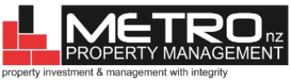
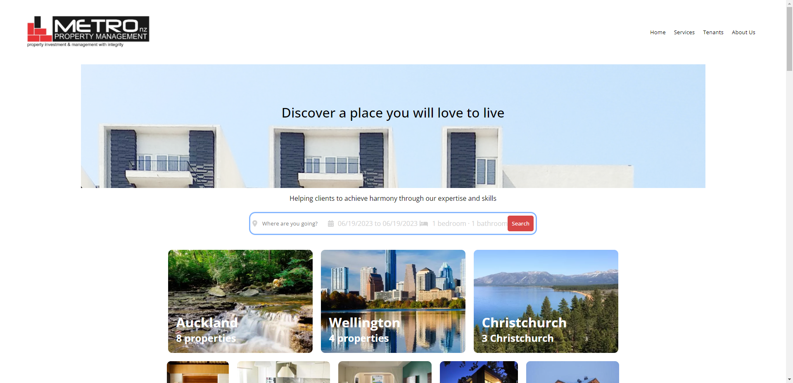
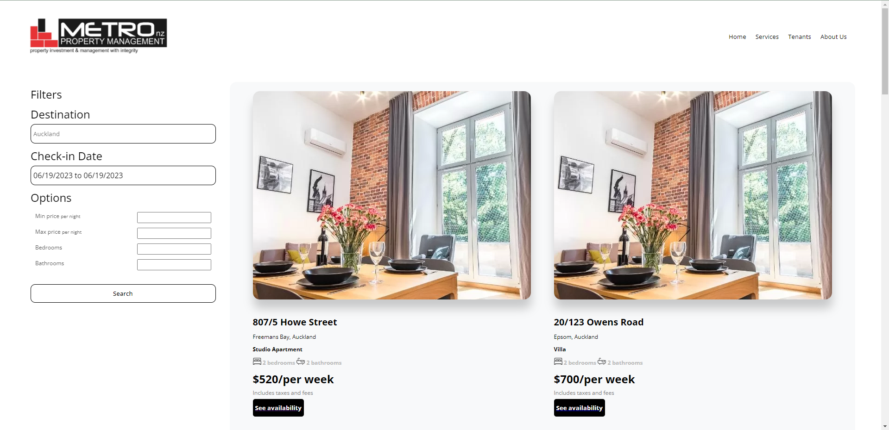
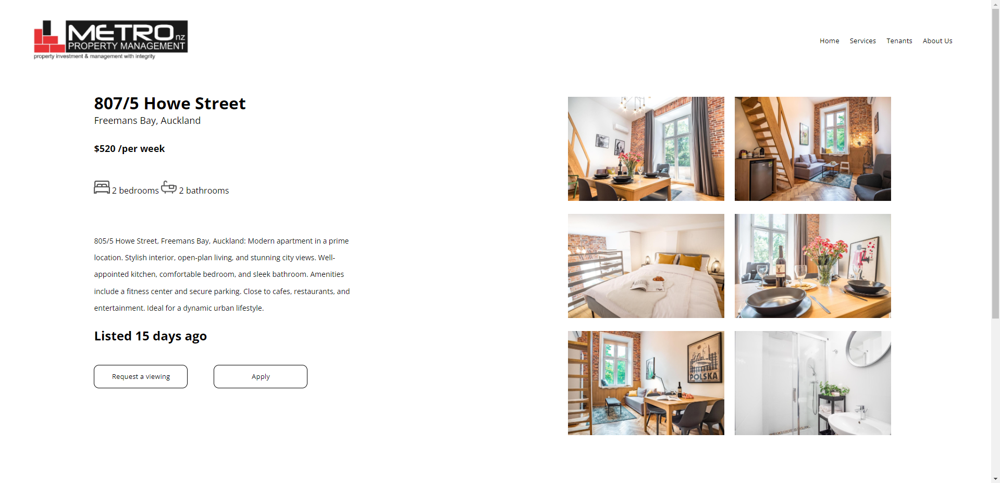

<!-- REFERENCES -->

[![Contributors][contributors-shield]][contributors-url]
[![Forks][forks-shield]][forks-url]
[![Stargazers][stars-shield]][stars-url]
[![Issues][issues-shield]][issues-url]

<!-- PROJECT LOGO -->
<br />
<div align="center">
  <a href="https://github.com/oliverlelievre/Metro-Property-Management-MERN-Application.git">
    
  </a>

<h3 align="center">Mission 5 - Metro Property Management Page Re-design</h3>
<h4 align="center">Oliver Le Lievre and Chao Xin Nhin<h4>

  <p align="center">  
    <a href="https://github.com/oliverlelievre/Metro-Property-Management-MERN-Application"><strong>Explore the docs »</strong></a>
    <br />
    <br />
    <a href="https://github.com/oliverlelievre/Metro-Property-Management-MERN-Application">View Demo</a>
    ·
    <a href="https://github.com/oliverlelievre/Metro-Property-Management-MERN-Application">Report Bug</a>
    ·
    <a href="https://github.com/oliverlelievre/Metro-Property-Management-MERN-Application">Request Feature</a>
  </p>
</div>

<!-- TABLE OF CONTENTS -->
<details>
  <summary>Table of Contents</summary>
  <ol>
    <li>
      <a href="#about-the-project">About The Project</a>
      <ul>
        <li><a href="#built-with">Built With</a></li>
      </ul>
    </li>
    <li>
      <a href="#getting-started">Getting Started</a>
      <ul>
        <li><a href="#prerequisites">Prerequisites</a></li>
        <li><a href="#installation">Installation</a></li>
      </ul>
    </li>
    <li><a href="#usage">Usage</a></li>
    <li><a href="#contributing">Contributing</a></li>
    <li><a href="#contact">Contact</a></li>
  </ol>
</details>

<!-- ABOUT THE PROJECT -->

## About The Project

&nbsp;&nbsp;&nbsp;&nbsp;&nbsp;&nbsp;

The Metro Property Management Landing Page Re-design project is part of our requirement for Mission Ready Level 5 Certification. As the developer, our task was to utilize MongoDB Compass as the database, build an API to interact with the database, and develop the user interface (UI) based on the designs provided by our UXD Team. We successfully dockerized the application using Docker Compose, allowing for easy deployment and management. The UI will display the collection of properties from MongoDB, providing a streamlined and user-friendly experience for Metro Property Management.

### Built With

- [![MongoDB][mongodb.com]][MongoDB-url]
- [![Express][expressjs.com]][Express-url]
- [![React][React.js]][React-url]
- [![NodeJS][nodejs.org]][NodeJS-url]
- [![Sass][sass-lang.com]][Sass-url]
- [![Typescript][typescriptlang.org]][Typescript-url]

<p align="right">(<a href="#readme-top">back to top</a>)</p>

<!-- GETTING STARTED -->

## Getting Started

To get a local copy up and running, follow these simple example steps.

### Prerequisites

Make sure you have Node.js and MongoDB Compass installed in your computer. To check if you have it installed and see its version, type the following script in your Terminal

- Terminal
  ```sh
  node -v
  mongod -version
  ```

### Installation

1. Clone the repository

   ```sh
   git clone https://github.com/oliverlelievre/Metro-Property-Management-MERN-Application
   ```

2. Create a .env file at the parent directory of server

   ```sh
   MONGO = 'url of your mongodb compass working database'
   MONGO_TEST = 'url of your mongodb compass test database'
   SERVER_PORT = 9000 //this is to make sure that the port is the same as what is set on the Dockerfile
   ```

3. Create a .env file at the parent directory of client
   ```sh
   PORT = 3000 //this is to make sure that the port is the same as what is set on the Dockerfile
   ```
4. On your terminal, go to server directory then install the packages inside package.json using the following scripts

   ```sh
   cd server
   npm install
   ```

5. Add a new terminal, go to client directory then install the packages inside package.json using the following scripts
   ```sh
   cd client
   npm install
   ```

<p align="right">(<a href="#readme-top">back to top</a>)</p>

<!-- USAGE -->

## Usage

To run the project on your local desktop run the following scripts:

1. On your terminal, go to server directory then start the db connection and the server

   ```sh
   cd server
   yarn dev
   ```

2. Add a new terminal, go to ui directory then run the client. It will automatically open a browser tab

   ```sh
   cd client
   yarn start
   ```

3. Put instructions to post request

<!-- DOCKER -->

## Running the Docker Image

To create a docker image of the project on your local desktop run the following scripts:

1. Inside the ui folder, change the proxy settings from "http://localhost:9000" to "http://api:9000" on the package.json file.

   ```sh
   "proxy": "http://api:9000"
   ```

2. Inside the server folder, change the MONGO_URL from "mongodb://127.0.0.1:27017/db-name?" to "mongodb://mongo:27017/db-name?" on the .env file.

   ```sh
   MONGO_URL = 'mongodb://mongo:27017/db-name?'
   ```

3. Once everything is changed, go to server directory on your terminal then run the docker script

   ```sh
   cd server
   docker build -t metro_api .
   ```

4. Go to client directory then run the docker script

   ```sh
   cd..
   cd client
   docker build -t metro_frontend .
   ```

5. You can finally run the docker script on the terminal of mission-5's parent directory
   ```sh
   cd..
   docker-compose up
   ```

<!-- CONTRIBUTING -->

## Contributing

Contributions are what make the open source community such an amazing place to learn, inspire, and create. Any contributions you make are **greatly appreciated**.

If you have a suggestion that would make this better, please fork the repo and create a pull request. You can also simply open an issue with the tag "enhancement".
Don't forget to give the project a star! Thanks again!

1. Fork the Project
2. Create your Feature Branch (`git checkout -b feature/AmazingFeature`)
3. Commit your Changes (`git commit -m 'Add some AmazingFeature'`)
4. Push to the Branch (`git push origin feature/AmazingFeature`)
5. Open a Pull Request

<p align="right">(<a href="#readme-top">back to top</a>)</p>

<!-- CONTACT -->

## Contact

Oliver Le Lievre - hello@iamollie.com
Chao Xin Nhin - chaon@missionreadyhq.com

Project Link: [https://github.com/oliverlelievre/Metro-Property-Management-MERN-Application](https://github.com/oliverlelievre/Metro-Property-Management-MERN-Application)

<p align="right">(<a href="#readme-top">back to top</a>)</p>

<!-- ACKNOWLEDGMENTS -->

## Acknowledgments

We would like to acknowledge our UXD Team, Cloe Kim and Melissa Zhen, for the awesome design they provided and for being patient with us as we code the project :)

<p align="right">(<a href="#readme-top">back to top</a>)</p>

<!-- MARKDOWN LINKS & IMAGES -->

[contributors-shield]:
[React.js]: https://img.shields.io/badge/React-20232A?style=for-the-badge&logo=react&logoColor=61DAFB
[React-url]: https://reactjs.org/
[Sass-lang.com]: https://img.shields.io/badge/Sass-20232A?style=for-the-badge&logo=sass&logoColor=CF649A
[Sass-url]: https://sass-lang.com/
[typescriptlang.org]: https://img.shields.io/badge/Typescript-20232A?style=for-the-badge&logo=typescript&logoColor=3178C6
[Typescript-url]: https://www.typescriptlang.org/
[mongodb.com]: https://img.shields.io/badge/MongoDB-20232A?style=for-the-badge&logo=mongodb&logoColor=409937
[MongoDB-url]: https://www.typescriptlang.org/
[expressjs.com]: https://img.shields.io/badge/Express-20232A?style=for-the-badge&logo=express&logoColor=646464
[Express-url]: https://www.typescriptlang.org/
[nodejs.org]: https://img.shields.io/badge/NodeJS-20232A?style=for-the-badge&logo=node.js&logoColor=5AAB46
[NodeJS-url]: https://nodejs.org/en

# Metro-Property-Management-MERN-Application
